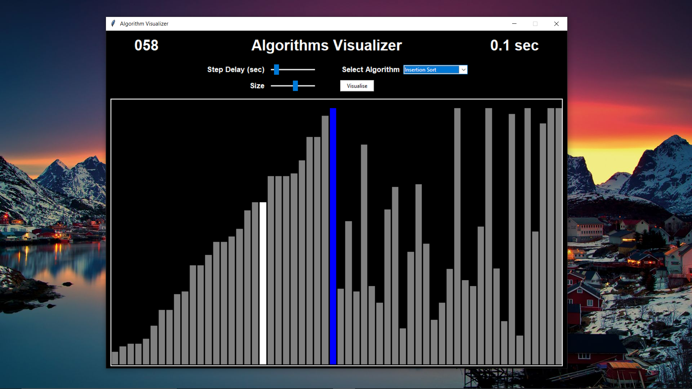
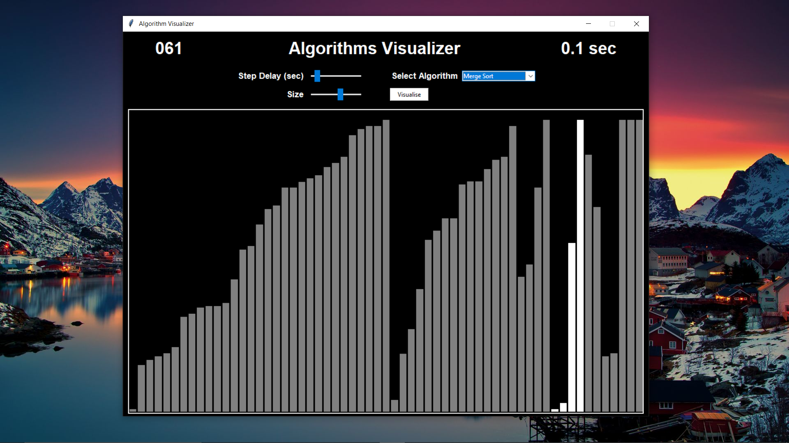

# Algorithm-Visualizer
Learn Algorithms by seeing them in action! Algorithms made easy through animations made in python3 using tkinter library

## Contents
  - [User Interface](#user-interface)
  - [Features](#features)
  - [Algorithms Covered](#algorithms-covered)
    - [Linear Search](#linear-search)
    - [Binary Search](#binary-search)
    - [Bubble Sort](#bubble-sort)
    - [Selection Sort](#selection-sort)
    - [Insertion Sort](#insertion-sort)
    - [Merge Sort](#merge-sort)
    - [Quick Sort](#quick-search)
    - [Radix Sort](#radix-search)
  - [Cheat Sheet](#time-complexity-cheat-sheet)

## User Interface

 



## Features
- Generate rectangular components with random heights representing element values to be worked upon
- Change number of elements - _'Size'_ and dynamically update the rectangular components. _'Size' can range from 3 to 100_
- Set _'Step-Delay'_ (in sec) - the time interval between each consecutive operation. _Step-delay can range from 0.0-1.0 sec with a resolution of 0.1 sec_
- Sliders have been provided for setting _'Size'_ and _'Step-Delay'_ thus eliminating the hassle of manual input
- Combobox for selecting Algorithm to visualize
- Counters for indicating _'Size'_ and _'Step-Delay'_

 

__NOTE: Although efforts have been made to keep the color scheme of the elements intuitive enough, if you wish to check a particular color you can look up the color reference provided for every algorithm__ 

 

## Algorithms Covered
- ### Searching
  - #### Linear Search
    
    ##### Complexity
    - Best    :  Ω(1)
    - Average :  θ(n)
    - Worst   :  O(n)
    ##### Color Reference
    - Grey bar  : Elements
    - Blue bar  : Element to be searched
    - White bar : Element currently checking for equivalence
    - Green bar : Element found
    - Red bar   : Element found unequal
  - #### Binary Search
    
    ##### Complexity
    - Best    :  Ω(1)
    - Average :  θ(log n)
    - Worst   :  O(log n)
    ##### Color Reference
    - Grey bar  : Elements
    - Blue bar  : Element to be searched
    - Red bar   : Elements discarded after checking
    - Green bar : Element found
- ### Sorting
  - #### Bubble Sort
    
    ##### Complexity
    - Best    :  Ω(n)
    - Average :  θ(n^2)
    - Worst   :  O(n^2)
    ##### Color Reference
    - Grey bar  : Elements
    - Red bar   : Elements not found in sorted order
    - White bar : Element currently being compared
    - Green bar : Element in sorted order
  - #### Selection Sort
    
    ##### Complexity
    - Best    :  Ω(n^2)
    - Average :  θ(n^2)
    - Worst   :  O(n^2)
    ##### Color Reference
    - Grey bar  : Elements
    - Blue bar  : Element found to be minimum in that iteration
    - White bar : Element being compared with minimum element
    - Green bar : Element in sorted order
  - #### Insertion Sort
    
    ##### Complexity
    - Best    :  Ω(n)
    - Average :  θ(n^2)
    - Worst   :  O(n^2)
    ##### Color Reference
    - Grey bar  : Elements
    - Blue bar  : Element at key index (element to be inserted)
    - White bar : Element 
    - Red bar   : Element less than the element at key index
    - Green bar : Element sorted
  - #### Merge Sort
    
    ##### Complexity
    - Best    :  Ω(nlog n)
    - Average :  θ(nlog n)
    - Worst   :  O(nlog n)
    ##### Color Reference
    - Grey bar  : Elements
    - Blue bar  : Elements being compared while merging sorted elements
    - White bar : Elements being sorted recursively
    - Green bar : Element found smaller while merging sorted elements
  - #### Quick Sort(*)
  
    ##### Complexity
    - Best    :  Ω(nlog n)
    - Average :  θ(nlog n)
    - Worst   :  O(n^2)
    ##### Color Reference
    - Grey bar  : Elements
    - Blue bar  : Elements being compared while merging sorted elements
    - White bar : Elements being sorted recursively
    - Green bar : Element found smaller while merging sorted elements
  - #### Radix Sort(*)
  
    ##### Complexity
    - Best    :  Ω(nk)
    - Average :  θ(nk)
    - Worst   :  O(nk)
    ##### Color Reference
    - Grey bar  : Elements
    - Blue bar  : Elements being compared while merging sorted elements
    - White bar : Elements being sorted recursively
    - Green bar : Element found smaller while merging sorted elements

  ## Time complexity cheat-sheet
  

  ## Skip to a particular section
  - [User Interface](#user-interface)
  - [Features](#features)
  - [Algorithms Covered](#algorithms-covered)
    - [Linear Search](#linear-search)
    - [Binary Search](#binary-search)
    - [Bubble Sort](#bubble-sort)
    - [Selection Sort](#selection-sort)
    - [Insertion Sort](#insertion-sort)
    - [Merge Sort](#merge-sort)
    - [Quick Sort](#quick-search)
    - [Radix Sort](#radix-search)
  - [Cheat Sheet](#time-complexity-cheat-sheet)